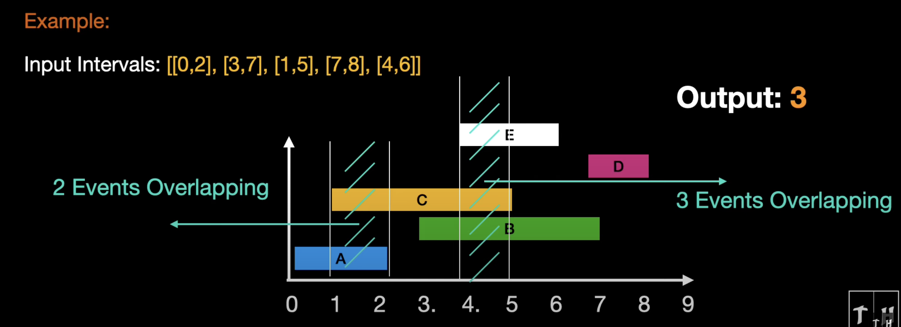
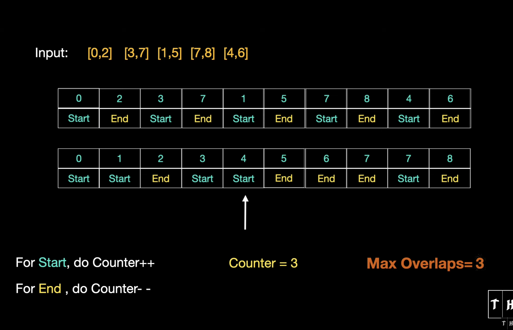

# Bill customers

## Questions

- Is the data clean? Repeated callIds?
- Will we bill the call separately if it spans different days? Yes.

## Getting the call records

We get all the customer call records as a list of objects. `response.json().callRecords = [...]`

```json
[
  {
    "customerId": 47260,
    "callId": "185e4202-191d-4938-9776-48bf4f31aff8",
    "startTimestamp": 1704532680000,
    "endTimestamp": 1704534360000
  },
  {
    "customerId": 71786,
    "callId": "4c7f1bee-5280-4948-b00d-4c9b2f4c2c62",
    "startTimestamp": 1705061580000,
    "endTimestamp": 1705062480000
  }
]
```

### For each call in the call record

Since the customer calls will be billed separately on different days, calls that happen on the same day are billed together, But calls that *span multiple days* are *billed separately*.

- If a call spans two or more days, we will split that call into multiple calls, the first call will end at the timestamp of the first day, the second call will start at the timestamp of the second day, and so on, the last call will always end at the timestamp of the original call.

#### Extract the calls in days

- (If it doesnt span days we get one call back)

##### For each call in calls

- add the call to groupedCalls using the customer id and date as keys

```json
{
  "1234": {
    "2025-01-01": [
      {
        "callId": "1234-5678-90",
        "startTimestamp": 1705185840000,
        "endTimestamp": 1705185850000
      },
    ]
  },
}
```

> Grouped Call Records

## Generate the concurrent calls list

### Loop over the customer calls (.id.date)

- sort the customer grouped dated calls by timestamp

#### Get the maximum concurrency data from the sorted grouped calls

Data needed

- active calls | set
- max active calls | list
- peak Time | number
- max Concurrent Calls | number
- counter | number

- callIntervals | list
List of calls, spread by their start and end time, transition checks if it's a start or an ending, we use:

```json
[
  {
    "callId": "call.callId",
    "timestamp": "call.startTimestamp",
    "callTransition": 1 // Starting call
  },
  {
    "callId": "call.callId",
    "timestamp": "call.endTimestamp",
    "callTransition": -1 // Ending call
  }
]
...
```




- then sort that array to get an annotated timeline!
- get the maxCalls, concurrentIds and peakTime (start time with max active calls)

#### Put that data in the final concurrentCalls array

```json
[
  {
    "customerId": "parseInt(customerId, DECIMAL)",
    "date": "date",
    "maxConcurrentCalls": "maxConcurrentCalls",
    "callIds": "concurrentCallIds",
    "timestamp": "peakTime",
  },
]
```
